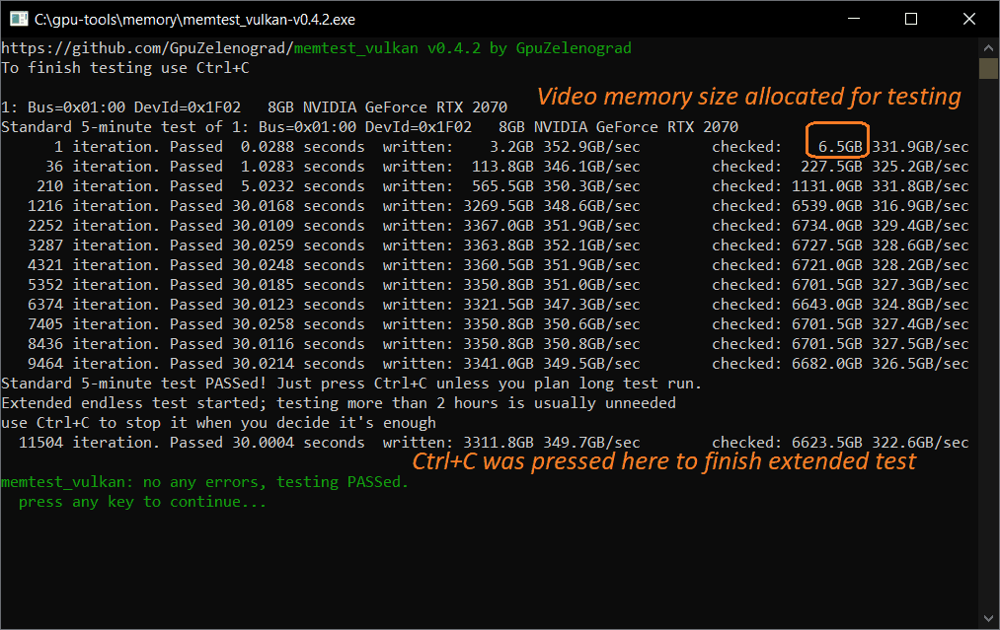
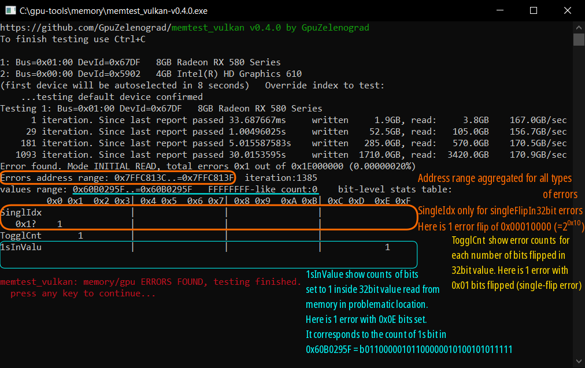
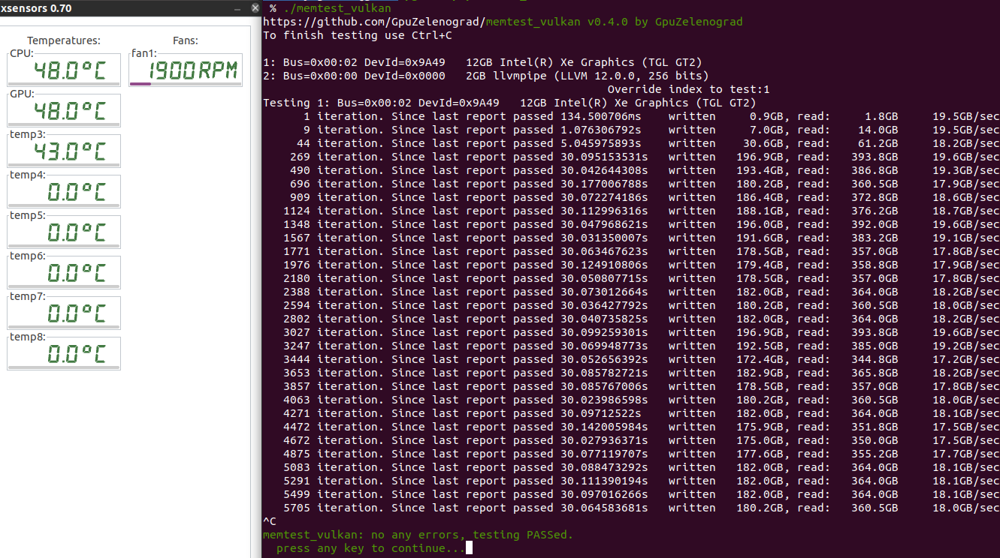

# [memtest_vulkan](https://github.com/GpuZelenograd/memtest_vulkan/blob/main/Readme.md) - GPU memory testing tool

Opensource cross-platform tool written in vulkan compute to stress test video memory for stability during overclocking or repair.

Just start application, wait at least 6 minutes and stop testing by Ctrl+C. Detected errors are displayed immediately during test run.

Requires system-provided vulkan loader and driver supporting Vulkan 1.1 (already installed with graphics drivers on most OS).

## Installation & Usage (Windows)

[⬇Get 64-bit .exe from latest release](https://github.com//GpuZelenograd/memtest_vulkan/releases#user-content-Downloads). GitHub users also may want to try [CI build artifacts](https://github.com/GpuZelenograd/memtest_vulkan/actions) (only last 3 months kept).

Start test by double-clicking the utility, no installation / parameters / configuration / admin-rights required.


Any found errors are immediately reported with a multi-line details. Detailed descriptions given below may help in advanced cases, but most of the time it's enough just check if errors are absent or present
<a id="errors_screenshot"></a>


<details><summary>
Alternatively, the tool can be started from cmdline
</summary>
<pre>
C:\gpu-tools\memory>memtest_vulkan.exe
https://github.com/GpuZelenograd/memtest_vulkan v0.3.0 by GpuZelenograd
To finish testing use Ctrl+C

1: Bus=0x00:00 DevId=0x9A49   8GB Intel(R) Iris(R) Xe Graphics
Testing 1: Bus=0x00:00 DevId=0x9A49   8GB Intel(R) Iris(R) Xe Graphics
      1 iteration. Since last report passed 271.3561ms      written     1.8GB, read:     3.5GB     19.3GB/sec
      5 iteration. Since last report passed 1.0910091s      written     7.0GB, read:    14.0GB     19.2GB/sec
     42 iteration. Since last report passed 10.2049349s     written    64.8GB, read:   129.5GB     19.0GB/sec
    409 iteration. Since last report passed 100.2136744s    written   642.2GB, read:  1284.5GB     19.2GB/sec
    791 iteration. Since last report passed 100.0165577s    written   668.5GB, read:  1337.0GB     20.1GB/sec
   1173 iteration. Since last report passed 100.1249672s    written   668.5GB, read:  1337.0GB     20.0GB/sec
   1551 iteration. Since last report passed 100.0042873s    written   661.5GB, read:  1323.0GB     19.8GB/sec
(Ctrl-C pressed)
memtest_vulkan: no any errors, testing PASSed.
  press any key to continue...
</pre>
</details>

### Installation & Usage (Linux)

Install by unpacking archives with linux prebuilt binaries for X86_64 (Desktop) or AARCH64 (Embedded) from 
[Releases](https://github.com//GpuZelenograd/memtest_vulkan/releases#user-content-Downloads) or [ artifacts](https://github.com/GpuZelenograd/memtest_vulkan/actions) (github account required). Build artifacts are transparently produced from source by github actions, but only last 3 months kept.

Use by opening a terminal in a folder with extracted file and explicitly running `./memtest_vulkan`. Do NOT just double-click binary in GUI (it would lead to starting test in the background without ability to stop it - [issue](https://github.com/GpuZelenograd/memtest_vulkan/issues/11))

Linux platform often contains additional `llvmpipe` pure-CPU vulkan driver. So after the start device selection menu will be shown. You can wait 10 seconds for automatic device selection or manually type the device number to test



<details><summary>With multiple drivers packages installed running under linux may require explicitly setting environment variables
</summary>
The details & reasons about the variables are discussed in [troubleshooting section](#troubleshooting), here are only execution examples
<pre>
[user@host ~]$ VK_DRIVER_FILES=/usr/share/vulkan/icd.d/nvidia_icd.json ./memtest_vulkan
https://github.com/GpuZelenograd/memtest_vulkan v0.3.0 by GpuZelenograd
To finish testing use Ctrl+C

1: Bus=0x01:00 DevId=0x2204   24GB NVIDIA GeForce RTX 3090
Testing 1: Bus=0x01:00 DevId=0x2204   24GB NVIDIA GeForce RTX 3090
      1 iteration. Since last report passed 56.112854ms     written    19.5GB, read:    22.8GB    752.9GB/sec
     19 iteration. Since last report passed 1.011701765s    written   351.0GB, read:   409.5GB    751.7GB/sec
    199 iteration. Since last report passed 10.050222094s   written  3510.0GB, read:  4095.0GB    756.7GB/sec
   1954 iteration. Since last report passed 100.004113065s  written 34222.5GB, read: 39926.2GB    741.5GB/sec
^C
memtest_vulkan: no any errors, testing PASSed.
  press any key to continue...
</pre>

Example run with a single-wire/singe-bit error
<pre>
[user@host ~]$ ./memtest_vulkan
https://github.com/GpuZelenograd/memtest_vulkan v0.3.0 by GpuZelenograd
To finish testing use Ctrl+C

1: Bus=0x01:00 DevId=0x1B87   8GB NVIDIA P104-100
Testing 1: Bus=0x01:00 DevId=0x1B87   8GB NVIDIA P104-100
      1 iteration. Since last report passed 52.20479ms      written     3.8GB, read:     7.5GB    215.5GB/sec
     21 iteration. Since last report passed 1.0515038s      written    75.0GB, read:   150.0GB    214.0GB/sec
    216 iteration. Since last report passed 10.021230569s   written   731.2GB, read:  1462.5GB    218.9GB/sec
   2125 iteration. Since last report passed 100.010942973s  written  7158.8GB, read: 14317.5GB    214.7GB/sec
Error found. Mode NEXT_RE_READ, total errors 0x3C7EC3 out of 0x3C000000 (0.39384872%)
Errors address range: 0x9D66148C..=0xDCD3036B  deatils:
         0x0 0x1  0x2 0x3| 0x4 0x5  0x6 0x7| 0x8 0x9  0xA 0xB| 0xC 0xD  0xE 0xF
Err1BIdx                 |      1m         |                 |                 
   0x1?                  |      1m         |                 |                 
ErrBiCnt      3m 820k    |                 |                 |                 
MemBiCnt            1   2|  32 249 13645067| 15k 39k  81k142k|219k308k 398k468k
   0x1? 506k502k 448k353k|239k134k  63k 25k|79792113  310  43|   5        1    
actual_ff: 0 actual_max: 0xFFFFFFB7 actual_min: 0x00000730 done_iter_or_err:4294967295 iter:1 calc_param 0x00100107
Error found. Mode INITIAL_READ, total errors 0x7E0C6E out of 0x3C000000 (0.82062860%)
Errors address range: 0x11640B6C4..=0x1DFFFEFFF  deatils:
         0x0 0x1  0x2 0x3| 0x4 0x5  0x6 0x7| 0x8 0x9  0xA 0xB| 0xC 0xD  0xE 0xF
Err1BIdx                 |      3m         |                 |                 
   0x1?                  |      3m         |                 |                 
ErrBiCnt      6m   1m    |                 |      51    3 598|  302573   824924
   0x1?  1084402   772471|  22 878    7 152|   1   4    1    |                 
MemBiCnt                7|  43 285 15296317| 19k 50k 107k200k|326k483k 653k817k
   0x1? 949k  1m 999k886k|704k493k 297k149k| 62k 20k 57931263| 185  21    1    
actual_ff: 0 actual_max: 0xFFFFFF46 actual_min: 0x000000B0 done_iter_or_err:4294967295 iter:2160 calc_param 0x8708AB91
Runtime error: ERROR_DEVICE_LOST while getting () in context wait_for_fences
</pre>
...hangs in-kernel due to driver
</details>

<details><summary>
64-bit ARM platforms are supported by AARCH64 binary.
</summary>

Example run on NVIDIA Jetson
<pre>
jetson-nx-alpha :: ~ » ./memtest_vulkan
https://github.com/GpuZelenograd/memtest_vulkan v0.3.0 by GpuZelenograd
To finish testing use Ctrl+C

1: Bus=0x00:00 DevId=0xA5BA03D7   8GB NVIDIA Tegra Xavier (nvgpu)
Testing 1: Bus=0x00:00 DevId=0xA5BA03D7   8GB NVIDIA Tegra Xavier (nvgpu)
      1 iteration. Since last report passed 163.678336ms    written     2.4GB, read:     4.8GB     43.5GB/sec
      7 iteration. Since last report passed 1.045756448s    written    14.2GB, read:    28.5GB     40.9GB/sec
     61 iteration. Since last report passed 10.06722992s    written   128.2GB, read:   256.5GB     38.2GB/sec
    593 iteration. Since last report passed 100.063183744s  written  1263.5GB, read:  2527.0GB     37.9GB/sec
   1121 iteration. Since last report passed 100.043447136s  written  1254.0GB, read:  2508.0GB     37.6GB/sec
^C
memtest_vulkan: no any errors, testing PASSed.
  press any key to continue...
</pre>

Raspberry 4 with 64-bit Broadcom V3D vulkan driver is also supported, but the achieved performance is quite low. No GUI required, test can be started via SSH connection:
<pre>
root@raspberrypi:/root# ./memtest_vulkan
https://github.com/GpuZelenograd/memtest_vulkan v0.4.2 by GpuZelenograd
To finish testing use Ctrl+C

1: Bus=0x00:00 DevId=0xBE485FD3   1GB V3D 4.2
2: Bus=0x00:00 DevId=0x0000   2GB llvmpipe (LLVM 14.0.6, 128 bits)
(first device will be autoselected in 0 seconds)   Override index to test:
    ...first device autoselected
Standard 5-minute test of 1: Bus=0x00:00 DevId=0xBE485FD3   1GB V3D 4.2
      1 iteration. Passed  1.8044 seconds  written:    0.2GB   0.6GB/sec        checked:    0.5GB   0.4GB/sec
      2 iteration. Passed  1.8037 seconds  written:    0.2GB   0.6GB/sec        checked:    0.5GB   0.4GB/sec
      5 iteration. Passed  5.4135 seconds  written:    0.8GB   0.6GB/sec        checked:    1.5GB   0.4GB/sec
     22 iteration. Passed 30.6776 seconds  written:    4.2GB   0.6GB/sec        checked:    8.5GB   0.4GB/sec
     39 iteration. Passed 30.6716 seconds  written:    4.2GB   0.6GB/sec        checked:    8.5GB   0.4GB/sec
     56 iteration. Passed 30.6738 seconds  written:    4.2GB   0.6GB/sec        checked:    8.5GB   0.4GB/sec
     73 iteration. Passed 30.6744 seconds  written:    4.2GB   0.6GB/sec        checked:    8.5GB   0.4GB/sec
     90 iteration. Passed 30.6714 seconds  written:    4.2GB   0.6GB/sec        checked:    8.5GB   0.4GB/sec
    107 iteration. Passed 30.6736 seconds  written:    4.2GB   0.6GB/sec        checked:    8.5GB   0.4GB/sec
    124 iteration. Passed 30.6688 seconds  written:    4.2GB   0.6GB/sec        checked:    8.5GB   0.4GB/sec
    141 iteration. Passed 30.6810 seconds  written:    4.2GB   0.6GB/sec        checked:    8.5GB   0.4GB/sec
    158 iteration. Passed 30.6751 seconds  written:    4.2GB   0.6GB/sec        checked:    8.5GB   0.4GB/sec
Standard 5-minute test PASSed! Just press Ctrl+C unless you plan long test run.
Extended endless test started; testing more than 2 hours is usually unneeded
use Ctrl+C to stop it when you decide it's enough
    192 iteration. Passed 30.6733 seconds  written:    4.2GB   0.6GB/sec        checked:    8.5GB   0.4GB/sec
^C
memtest_vulkan: no any errors, testing PASSed.
  press any key to continue...
</pre></details>

# Interpreting the results

The _only_ simple thing in result interpreting - is "If some errors are reported by memtest_vulkan - the PC has hardware problems". Most often GPU-related, but its hard to be sure if the problem is VRAM IC - related or GPU chip related.

You can create [topic in discussions](https://github.com/GpuZelenograd/memtest_vulkan/discussions/new?category=card-specific-memtest_vulkan-error-logs), sometimes the error log can be interpreted. Bust most of the time it is quite complex task, expand the theory section below

<details><summary>
      
## Video card memory error kinds (theory)

</summary>

### Classification of the errors by the "*what* have gone wrong"
* The single-bit errors like in an [image above](#errors_screenshot). Such errors are counted in ToggleCnt column 0x01 and the exact bit indices are counted in SingleIdx column. Such errors may be detected by EDC in theory if they occur during transmitting by EDC-enabled part of GPU<->memory wire. But I'm not sure if EDC helps if they occure when transmitting between gpu cache and gpu core or something like this.
* The errors on data-inversion bit (if not detected by EDC). Those should be counted in ToggleCnt columns 0x07/0x08 without SingleIdx info for them.
* The multi-bit transmission errors. Those should be counted in ToggleCnt columns above 0x01, without SingleIdx info for them.
* The errors flipped in the memory chips itself during data storage/"refresh cycles". This may be caused by too big period of refresh or other problems. memtest_vulkan uses a part of memory in a "write once at start but reread every time" pattern - it is the reason fot read GB is more then written GB. If a data flips inside this part of memory - there would be infinite log of error messages marked with "Mode NEXT_RE_READ" (in opposite to Mode INITIAL_READ). Lowering the clocks without restarting test doesn't get rid of such errors.
* The errors on the address-transmission bus. The metest_vulkan is designed to perform reads to the non-sequential series of medium-sized sequential blocks. And if the address is wrongly interpreted by a memory chip - the result is completely garbage from wrong cell. Data-bus EDC can't help here. Those errors typically gives completely random error patterns with normal distribution of bits count and flipped bits (so typical number of flipped bits are 12-20 of 32 and getting 1 flipped bit for this case is extremely unrealistic). The result looks like
```
Error found. Mode INITIAL_READ, total errors 0x2B788 out of 0x18000000 (0.04422069%)
Errors address range: 0x6000E900..=0xBFDFF9FF  iteration:38
values range: 0xFFFFA1A4..=0x0000166F   FFFFFFFF-like count:0    bit-level stats table:
         0x0 0x1  0x2 0x3| 0x4 0x5  0x6 0x7| 0x8 0x9  0xA 0xB| 0xC 0xD  0xE 0xF
SinglIdx                 |                 |                 |                 
TogglCnt                2|   7  18   95 264| 8451786 40056770| 11k 15k  20k 23k
   0x1?  23k 21k  17k 12k|81944859 24701266| 486 248   62  29|   4   2         
1sInValu                3|  19  66  223 700|17683704 6856 11k| 16k 21k  25k 26k
   0x1?  23k 17k  12k6327|2883 917  282  64|   9             |
```
* Other critical errors inside memory chips or memory controller. This gives normal distributions for TogglCnt, but for 1sInValu the distribution may be different - since critical internal errors may be reported by some fixed patterns (0x00000000, 0xFFFFFFFF - for some EDC problems, 0x0BADAC?? - for some NVIDIA problems).
* Memory errors in the areas where error counts are stored)) This often shows as millions of errors in all table entries, typically with the total errors greater than tested memory size. Such results are numerically garbage, but means that the gpu/memory is really mostly non-functional.
* The errors in GPU during calculation of addresses and desired values or in value comparison. This can lead to any pattern of reporting at all, since the logic of a program is broken.


### Orthogonal classification by "*when* things have gone wrong"
* Simplest situation: "errors appears immediately when GPU+memory operates at given frequency". The tests report such nearly immediately.
* Temperature-dependent: sometimes the system works fine at room temperature but after getting hot due to continuous load the errors are coming. To catch such errors some pre-heat time is needed, the 5-6 minutes of standard test are designed exactly to wait for achieving higher temperatures.
* Near-the-limit, rare-occurring errors. When hardware is working near its limits, the errors can present but be fairly rare or depend on the outer factors like "electrical power network noise caused by powering on a drill in a nearby office". Catching such errors may require 2-3 hours of test run.
* Lower-frequency errors. Sometimes faulty memory or GPU can handle high-performance "huge frequency and medium timings" mode but fails to handle the low-performance "low frequency and small timings" mode. Such errors are hard to catch; the standard 5-6 minute test sometimes catches them during a special "several seconds pause of load" at the beginning of the 5-th minute, but that is not a reliable method.
* Frequency-switch errors. The GPU+memory may work fine at both high- and low-performance modes, but it may fail at the moment of the switching while clocks and timings are adjusted. Similar to above, hard to catch, sometimes caught at the beginning of the 5th minute.
Testing mode for the two later categories is still under development - it's tricky to check memory operation at lower frequency, since the driver nearly immediate switches to performance mode when load begins. However, v0.5 introduces a preliminary attempt to handle this. After initial pre-heat, the load is stopped for 15 seconds and then raises again.
</details>

# <a id="troubleshooting">Troubleshooting & reporting bugs</a>
Here is the list of common errors that prevent test from starting
* `memtest_vulkan: early exit during init: The library failed to load`<br>
This message means that your system lacks the Khronos Group Vulkan-Loader library. This library is used as a multiplexer between different drivers provided for different devices and typically is installed during installation of any device-specific vulkan driver. However, some platforms may need explicit installation: for example, to install it on ubuntu 18.04 run `sudo apt install libvulkan1`.
Note that this library itself doesn't depend on any GPU, it is loadable even without any vulkan-capable devices at all. So the error above is a pure software-related error, not related to hardware at all.
* `memtest_vulkan: early exit during init: ERROR_INCOMPATIBLE_DRIVER`<br>
`memtest_vulkan: early exit during init: ERROR_INITIALIZATION_FAILED`<br>
Those messages mean that your system lacks the vulkan driver for your GPU or your system doesn't have any vulkan-capable devices. If the device is known to be vulkan-capable try removing all GPU drivers and reinstalling/updating a driver for the device you want to test.
* `Runtime error: This device lacks support for DEVICE_LOCAL+HOST_COHERENT memory type.` <br>
Testing of some older pre-2016 GPUs is not supported due to driver limitations. For example, GTX780Ti on Windows even with latest 472.xx driver reports the message above. The same applies to newer NVIDIA GPUs on old windows 7 with 47x.xx driver - newer OS needed for testing.
* `Runtime error: Failed determining memory budget` on the integrated GPU <br>
If the integrated GPU is configured with fixed & quite low dedicated memory size - it may be shown in memtest_vulkan output only with 1GB VRAM: `1GB AMD Radeon(TM) Vega 3 Graphics` and then fail. The vulkan implementation for integrated GPUs allows using a bit less memory than reserved, and memtest_vulkan requires at least 1GB available memory to operate. Reconfigure integrated GPU to reserve at least 1.5GB of memory, see [issue #22](https://github.com/GpuZelenograd/memtest_vulkan/issues/22)
* `INIT OR FIRST testing failed due to runtime error` <br>
If the test fails to start and shows this message for a newer GPU - there is some incompatibility in vulkan installation. This may be caused by outdated driver or conflicts between several vulkan drivers installed. <br> <br>
For example on Linux the test can be run with a specific ICD the following way:<br>
`VK_DRIVER_FILES=/usr/share/vulkan/icd.d/nvidia_icd.json ./memtest_vulkan`<br>
[With Khronos vulkan loader `libvulkan.so` version below v1.3.207 use `VK_ICD_FILENAMES` instead of `VK_DRIVER_FILES`](https://github.com/KhronosGroup/Vulkan-Loader/blob/v1.3.233/docs/LoaderInterfaceArchitecture.md#table-of-debug-environment-variables)<br>
Also try running with root/admin privileges - this is sometimes required on headless devices.

There are some reports that testing AMD GPUs sometimes gives unexpectedly low GPU load & video memory usage. The issue is still under investigation, but it is known that disabling/enabling "resizable BAR" in BIOS may help.

Also, some drivers don't allow contiguous allocation of memory regions more than 4GB even on a GPU with a lot of memory. Such GPUs are tested with a 3.5GB memory allocation. This is not perfect, but such testing allows still allows detecting most of the errors, so don't bother if this is your case.

If nothing helps - enable verbose mode by renaming the executable to `memtest_vulkan_verbose` and running again. The test will output diagnostic information to stdout - please copy it to a new issue at https://github.com/GpuZelenograd/memtest_vulkan/issues.

<details><summary>

## <a id="development">New feature development</a>

</summary>
New ideas in the form of [suggestions via creating issues](https://github.com/GpuZelenograd/memtest_vulkan/issues) or pull requests are welcome. However, note that the tool is designed to be cross-platform, so an optimal way to add temperature and hardware monitoring is [relying on VK_KHR_performance_query extension](https://registry.khronos.org/vulkan/specs/1.3-extensions/man/html/VkPerformanceCounterUnitKHR.html), but unfortunately this extension isn't widely supported by 2022.

If you want to experiment with code modifications, there are two ways to do this:
 - the classic way of cloning repo, editing code and use locally-installed `cargo` to build binaries from modified rust source code
 - or the "fast way to make a small change relying on the github infrastructure". This can be useful if you are not familiar with building rust and don't plan to install it locally
      - fork this repository
      - enable workflows on the actions tab of the forked repository
      - edit&commit code changes (small changes are possible even via editing with a browser)
      - and github will build the binary from your changes for you as the artifacts on the actions tab in 5 minutes!
      
Since most of the time the GPUs are working fine, it may be hard to check the error handling behavior. The `MEMTEST_VULKAN_EMULATE_WRITE_BUG_ITERATION` environment variable was introduced to simplify this task. Set it to non-zero number generates 'fake' error during writing to the memory on the specified iteration that later would be found and reported during check stage.
</details>

# Acknowledgements
The idea inspired by OpenCL-based cross-platform memory testing tool [memtestCL](https://github.com/ihaque/memtestCL).

The implementation would not be possible without great vulkan bindings for rust provided by zlib-licensed [erupt library](https://gitlab.com/Friz64/erupt).
So, for licensing simplicity, memtest_vulkan is also licensed under the [zlib License](https://github.com/GpuZelenograd/memtest_vulkan/blob/main/LICENSE).

The `memtest_vulkan` itself was developed by [GpuZelenograd repair center](https://gpuzelenograd.github.io/README?memtest_vulkan)
